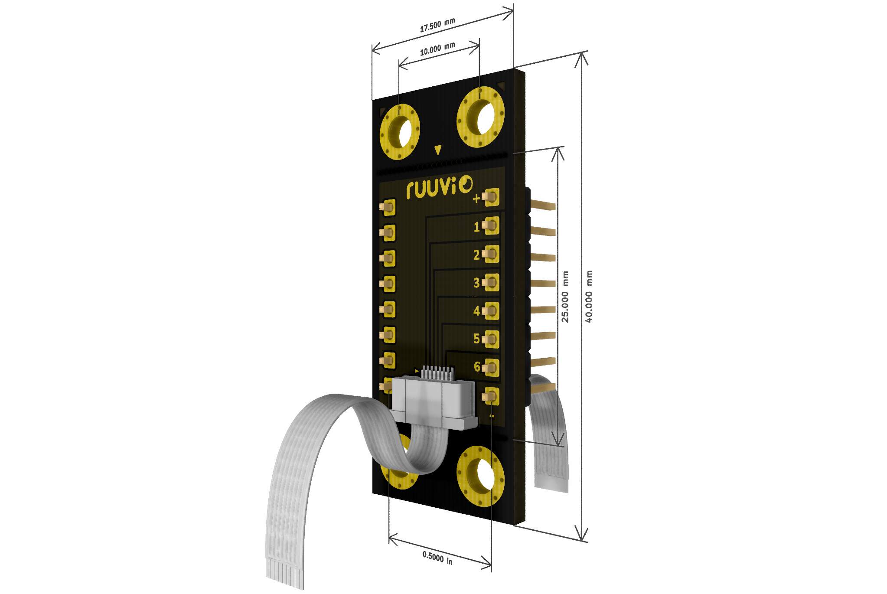
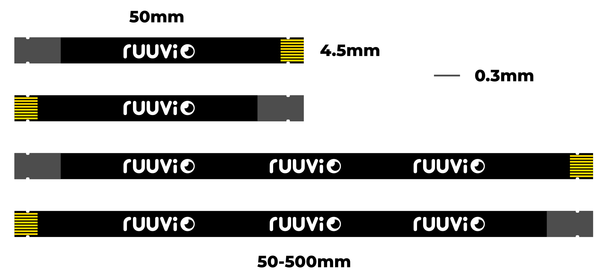

# Ruuvi Connector system

Ruuvi Connector is a standardised expansion connector and cable system that takes sensor prototyping to the next level. Compatible connectors will be found on many upcoming Ruuvi products.

There are many ways on how to use the Ruuvi Connector system:

1) Connect compatible external boards and sensors to your Ruuvi products
2) Design your own Ruuvi Connector expansion boards
3) Feed your battery powered Ruuvi products from external power sources
4) Add a Ruuvi Connector compatible connector on your own product and make it compatible with all the external Ruuvi / Grove / Qwiic / STEMMA / Gravity sensors
5) Innovate and create something totally new

Ruuvi Connector is compatible with 4-pin (2 signals + VDD + GND) prototyping systems such as [Seeed Studio Grove](http://wiki.seeedstudio.com/Grove_System/), [Sparkfun Qwiic](https://www.sparkfun.com/qwiic), [Adafruit STEMMA](https://learn.adafruit.com/introducing-adafruit-stemma-qt/), [DFRobot Gravity](https://www.dfrobot.com/gravity) and more.

## Ruuvi Connector pin-out

Ruuvi Connector cables have 8 pins (6 signals + VDD + GND). This allows using not just simple I2C sensors but also more powerful SPI sensors equipped with interrupt signals.

1) 1.8V - 3.6V (default = 3.3V)
2) PIN1 ( SCL / SCK / RXD / ADC1 / GPIO1 ) - compatible with Grove/Qwiic/others
3) PIN2 ( SDA / MISO / TXD / ADC2 / GPIO2 ) - compatible with Grove/Qwiic/others
4) PIN3 ( MOSI / ADC3 / GPIO3 )
5) PIN4 ( CS / ADC4 / GPIO4 )
6) PIN5 ( INT1 / ADC5 / GPIO5 )
7) PIN6 ( INT2 / ADC6 / GPIO6 )
8) GND

## Dimensions of expansion boards 

1) 17.5 x 40 mm (17.5 x 25 mm without mounting holes)
2) TBD
3) TBD
